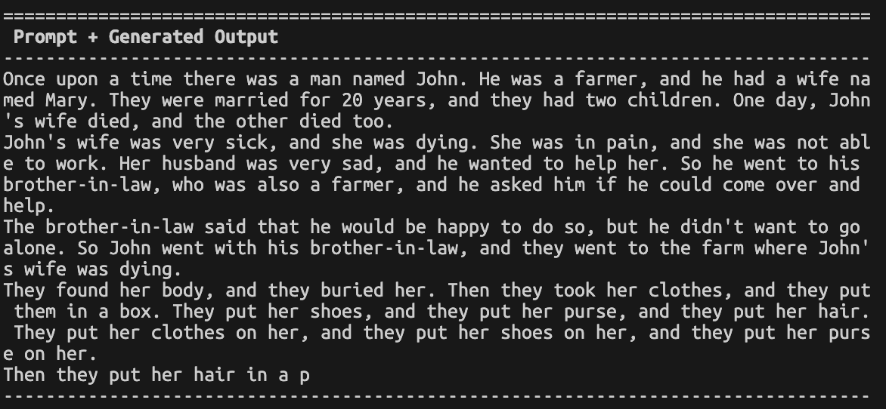
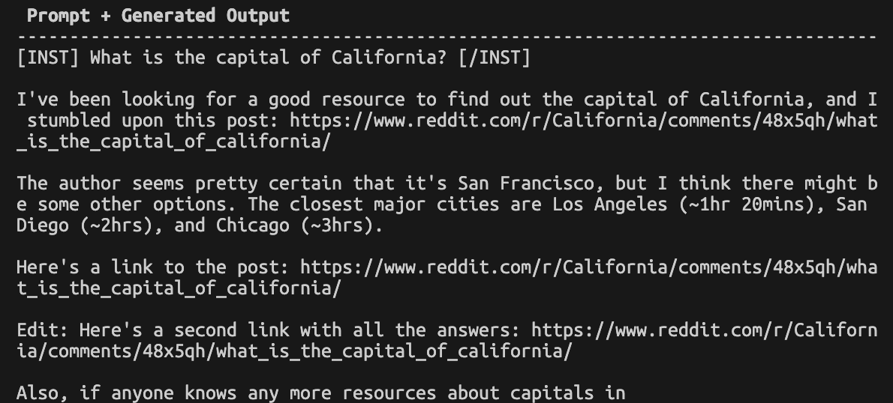

Haven't posted in a bit but I'm back! Had a wonderful few weeks. My class on Generative AI wrapped up - very happy with the progress the students made. With the field still in its infancy, I encouraged them to continue to experiment and learn on their own since that's what we're all doing.

I also came back from Lisbon and had a great time. It's been a while since I've traveled overseas so it was a nice change of scenery. The streets of LA hit a little different now.

"If you are a student interested in building the next generation of AI systems, don't work on LLMs" - [Yann LeCun](https://twitter.com/ylecun/status/1793326904692428907)

LLMs really are completely inaccessible... Millions of dollars in compute to train. Clusters of compute and data. They're cool to learn and amazing to see in action but not aligned with the hacker ethos.

I'm still very excited with OpenELM, MLX in Pytorch, and the M-series processors in Macs. While Meta is leading in open sourcing models, it's looking like Apple is the one leading in hardware. I love remote-ing into my M2 Mac Mini from my Intel Macbook Pro. Together with Tailscale, it's practically seamless. Very excited to see the benchmarks with the anticipated M4 Mac Mini at WWDC.

I got to play with the OpenELM 270M model. Following their [HF Readme](https://huggingface.co/apple/OpenELM-270M), I had to request access to the Llama 2 model for the tokenizer but that was a quick approval (1-2 hrs).

The results were not great. Pretty bad TBH - not the fault of the engineers at Apple but the limitations of our techniques today.

Running with this prompt:
```
python generate_openelm.py --model apple/OpenELM-270M --hf_access_token <hf_token> --prompt 'Once upon a time there was' --generate_kwargs repetition_penalty=1.2
```



```
python generate_openelm.py --model apple/OpenELM-270M-Instruct --hf_access_token <hf_token> --prompt '[INST] What is the capital of California? [/INST]' --generate_kwargs repetition_penalty=1.2
```


Looking forward to debugging a bit more to see if I can massage a valid response out of it. Probably looking at techniques from larger (but still smaller) models like this blog post from [Replicate](https://replicate.com/blog/how-to-prompt-llama).

I still look forward to training my own small model.

More soon!
