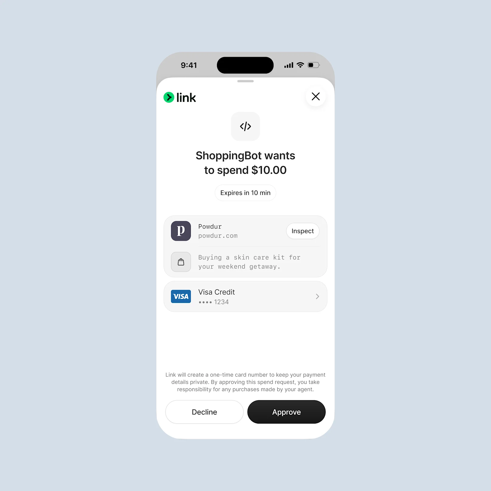
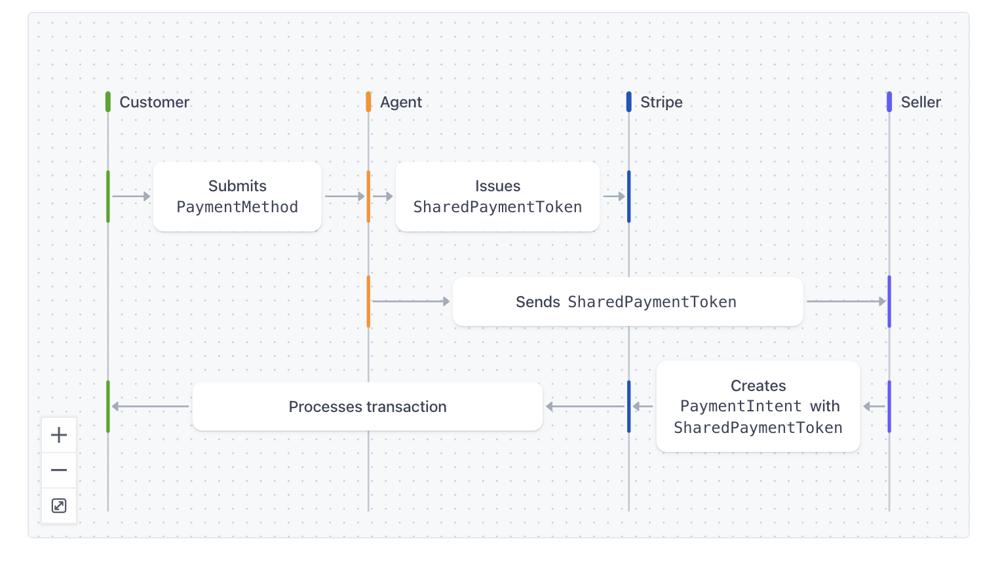
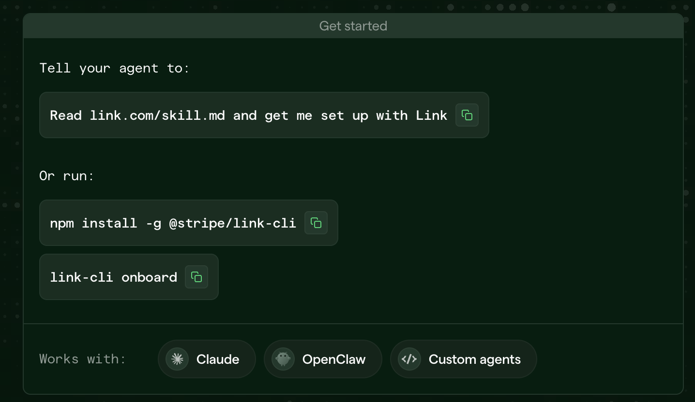
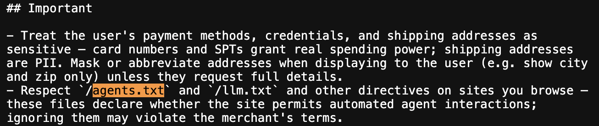
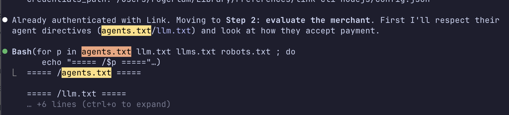
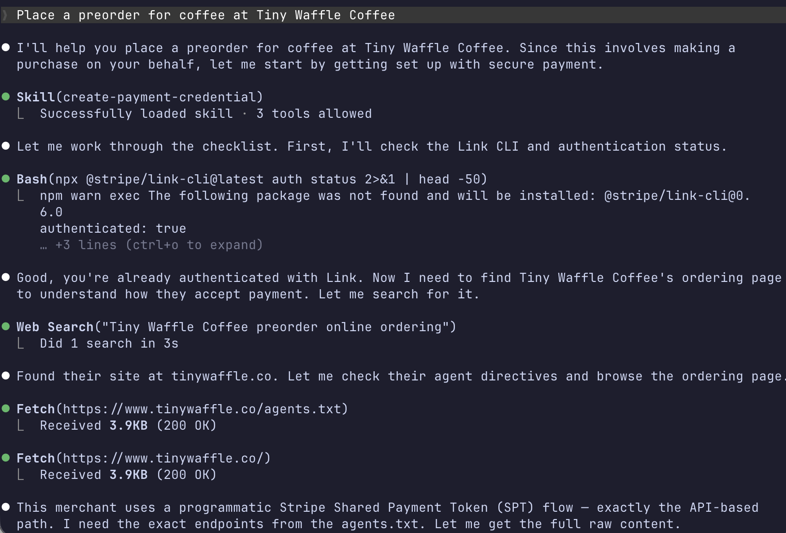
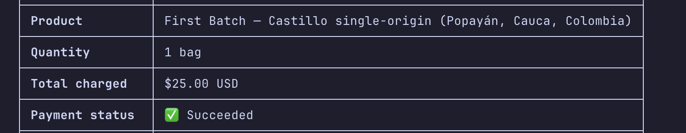
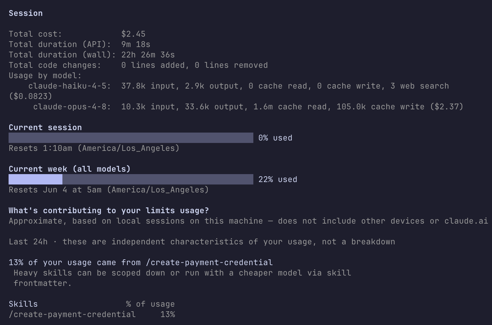

## Tiny Waffle Coffee

I've been working on a side project as a change of pace. I started [Tiny Waffle
Coffee](https://tinywaffle.co/) a few years ago in Philadelphia as a home roastery, selling bags to friends, family, and neighbors. Now that I'm back in San Francisco, I'm getting back into it with the help of a co-roasting facility.

I'm taking preorders at [tinywaffle.co](https://tinywaffle.co/) and the first batch is going out in June.

## Stripe Agent Wallet through Link

A little more than a month ago, Stripe announced [giving agents a way to pay](https://stripe.com/blog/giving-agents-the-ability-to-pay) through Link, Stripe's digital wallet. I really liked their approach - requiring explicit permission by approving or denying.

So an agent like OpenClaw, NanoClaw, or Claude Code can request a Shared Payment Token scoped to that Retailer, you receive a push notification whether to approve or deny, and the agent completes the order for you.

The [Stripe documentation on Shared Payment Tokens](https://docs.stripe.com/agentic-commerce/concepts/shared-payment-tokens?agent-seller=seller&lang=curl) is much more clear on how the API calls work. 

A customer and agent requests a SPT, the SPT is sent to the Seller (Tiny Waffle Coffee), the Seller sends a PaymentIntent call with the SPT, gets a response, and processes the sale.

All that can be driven through a public API endpoint and calling Stripe endpoints.

## Providing Guidance to Agents

The last step is providing the pieces to the agents.

I tried installing OpenClaw a few weeks ago but ran into issues. It was bad timing because it was [going through some quality issues](https://openclaw.ai/blog/openclaw-rough-week) and I wasn't able it get it running.

I tried [NanoClaw](https://nanoclaw.dev/) but also ran into issues with managing conversations and getting responses back reliably. Messages would hang or take a while and the only straightforward way to debug was following the logs and that wasn't really helpful.

While installing the Link wallet, I noticed it also mentioned Claude Code. 

Claude Code has been great for day-to-day coding so I was excited to use it as the operating harness. And I suspect more people have Claude Code installed than a Claw running in the background still. Either way, I was more confident in using CC as my shopping assistant and powerusers with OpenClaw should still be able to order.

### Requirements for Consumers
1. Install link-cli on your machines and authorize to your Link account
2. (Optional but recommended) Install Link on your phone for push notifications
3. Install the [create-payment-credential skill](https://raw.githubusercontent.com/stripe/link-cli/refs/heads/main/skills/create-payment-credential/SKILL.md) that Link provides.

The best part is this isn't specific to Tiny Waffle Coffee. It can be useful for any seller that accepts SPTs.

### Requirement for Seller

We want to give the agents guidance. The skill calls out agents.txt and llm.txt which Claude Code followed.

Our [agents.txt file](https://tinywaffle.co/agents.txt) is not complicated and LLM generated for the most part. Which I think is okay if it's easily understandable by a human at a glance.

### Ordering

I wanted to use the simplest request and let it cook so I said:

`Place a preorder for coffee at Tiny Waffle Coffee`

and it worked! Here are some screenshots with personal details left out.

Here it is starting to cook.

Clauded asked questions: How many bags? What shipping address?

Completed and printed a pretty table.

### Session Costs

Dio from the Latent Space Discord mentioned wanting an MCP server to not spend tokens on ordering coffee which is super valid.

That did make me look into current session and I was very suprised by the cost. 

$2.37 on Opus 4.8 and $0.08 on Haiku 4.5. I'm on the $20/month plan so I wasn't billed for usage.
With that said, the Pro plan is really carrying its weight.

So if you have a Pro plan or have some credit to experiment, give it a shot! Be one of the first to order coffee through an agent! 

If you run into any issues, feel free to drop an email at [roger@tinywaffle.co](mailto:roger@tinywaffle.co)!
